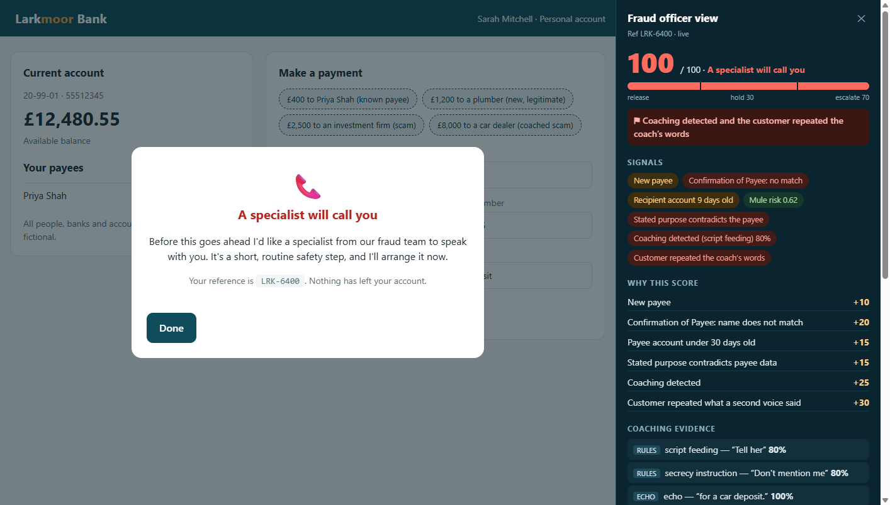

# Second Voice

**Scammers coach their victims through the bank's questions. Second Voice hears the coach.**

A scam-interrupt voice agent for UK banks, built on [AssemblyAI](https://www.assemblyai.com) for the AssemblyAI × lablab.ai Voice Agent Hackathon (Sep 2026).



*Left: what the customer sees. Right: the fraud officer's view — the live score, every signal, an itemised "why", and the coaching evidence.*

**Watch:** [`docs/video/second-voice-demo.mp4`](docs/video/second-voice-demo.mp4) (85 s, a real recorded run with narration) · [`docs/video/second-voice-teaser.mp4`](docs/video/second-voice-teaser.mp4) (23 s). The agent's voice and every on-screen signal are live output from the real system; the customer and scammer voices are synthetic (text-to-speech).

## The problem

In an authorised push payment (APP) scam the victim makes the payment themselves, often while a scammer stays on the phone and **coaches them through the bank's checks**: "tell her it's for a car deposit, don't mention me." Scripted in-app warnings get clicked through, and a human intervention call can be coached too. UK banks reported APP fraud losses of [£576.4m in 2025, up 19%](https://www.ukfinance.org.uk/policy-and-guidance/reports/annual-fraud-report-2026) (UK Finance Annual Fraud Report 2026). Since 7 October 2024 the [Payment Systems Regulator's scheme](https://www.psr.org.uk/media/rhelv4op/ps25-5-app-scams-reimbursement-consolidated-policy-statement-may-2025.pdf) requires the sending bank to reimburse eligible victims (up to £85,000 per claim), with the cost shared 50:50 with the receiving bank, so the loss now lands on the banks.

## What it does

When a customer starts a risky transfer, the bank app opens a short in-app **Voice Check**:

1. A conversational agent talks to the customer (what's the payment for, who is it to, how were you contacted, is anyone pressuring you?) and calls the bank's checks: Confirmation of Payee, recipient-account risk, the customer's history.
2. While they talk, the system listens for **coaching** — a second person scripting the answers, telling the customer to keep it secret, rushing them, or posing as the bank — and for the **customer repeating the coach's words**.
3. If it hears a coach, the agent gently asks: *"Is there someone there with you right now? Please remember that the bank will never ask you to keep a payment a secret or to lie to us."*
4. A deterministic, explainable score decides: **release**, **pause for 24 hours**, or **escalate to a fraud specialist**. There is never a flat refusal, and every hold offers a human.
5. A fraud officer watches the same call live and can export an audit record.

## How it works

```
Customer's laptop (one shared microphone: echo cancellation on)
  ├─► AssemblyAI Voice Agent API ── conversation, tool calls, turn-taking ──► stored agent (6 tools)
  └─► AssemblyAI Realtime STT ───── speaker labels + per-word loudness ─────► "what the room heard"
                         │
   Signal Engine: coaching language · echo (customer repeats the coach) · room-only speech
                         │
   Risk Scorer (deterministic points table, hard triggers, coaching floor) ──► decision + audit record
                         │
   Agent Injector: trusted system message → the agent asks ONE gentle question (max once / 20 s)
```

**AssemblyAI products used:** Voice Agent API (stored agent, client-side tools, `voice_focus`, trusted `conversation.message`, `reply.create`, `session.resume`) and Realtime Speech-to-Text (`universal-3-6-pro`, speaker diarization). An optional LLM Gateway second opinion is supported.

**Key design decisions** (all recorded, with the evidence, in `.claude/specs` and `.claude/plans`):

- **The LLM never makes the decision.** A transparent points table does, so every outcome can be explained line by line in the audit record.
- **Coaching detection is rules-first.** Instant, offline, and immune to prompt injection (a scammer who says "ignore your rules" gains nothing against a pattern). An LLM second opinion is opt-in and only consulted when the rules find nothing. Rules score 16/16 on the labelled cases and 8/10 on held-out cases, with zero false alarms; the two misses are documented.
- **Fail safe.** Mic denied, connection lost, bank unreachable → the payment is held, never released.
- **Privacy.** No audio is stored. Audit exports mask the account number and HTML-escape all spoken text.

## Honest limitations

- **It hears coaching at conversational volume** — a scammer on speakerphone within arm's reach of the laptop. True whispers across the room are not captured by a laptop microphone (measured: 0% at ~19 dB below normal speech). Louder sources are caught from farther away.
- **Speaker labels are a tie-breaker, never decisive.** They separated two clearly different voices in testing but were unreliable in short sessions with similar voices, and loudness alone cannot tell a phone from the customer.
- **The agent speaks English only** (the Voice Agent API's built-in voices); it understands 18 languages.
- All banks, people and accounts are fictional. The detector's scripted coach lines are a demo, not a claim about real-world recall.

## Try it

```bash
npm install
cp .env.example .env.local        # add ASSEMBLYAI_API_KEY
node scripts/create-agent.mjs     # prints the AGENT_ID line to add to .env.local
npm run dev                       # http://localhost:5173
```

Open **http://localhost:5173** on the laptop (the microphone needs `localhost` or HTTPS) and open **`/simulator`** on your phone. Put the phone on speakerphone next to the laptop.

| Demo scenario (one-click in the app) | What happens |
|---|---|
| £400 to a known payee | No friction at all — sent |
| £1,200 to a new, legitimate plumber | A short check, then **released** |
| £2,500 to an investment firm (close-match name, new account) | Held or escalated on bank signals alone |
| **£8,000 to a "car dealer"** (personal account opened 9 days ago) | Bank data alone → **hold (60)**. Tap "Play a coached call" on the phone → coaching caught → **escalate (85–100)** |

## Tests

```bash
npm run lint && npm run typecheck && npm test && npm run build
node scripts/eval-detect.mjs      # detector accuracy on labelled + held-out cases (offline)
```

430+ unit tests cover the scoring, signal engine, agent protocol (tool-result ordering, reconnect, fail-safes), tools, audit export and the simulator script. The whole flow was also run end to end in headless Chrome with a fake microphone against the live Voice Agent API.

## Deploy (Netlify, or Vercel)

**Netlify:** app.netlify.com → Add new site → Import from GitHub → this repo. Build settings come from `netlify.toml`; the whole API is one function (`netlify/functions/api.mts`) that serves `/api/*` through the same handlers used everywhere else. Add the environment variables `ASSEMBLYAI_API_KEY` and `AGENT_ID`, then redeploy.

**Vercel:** vercel.com/new (framework: Vite); `vercel.json` handles routing; same two environment variables.

Optional on either: `DETECT_MODEL` (+ `DETECT_STRUCTURED=0` for models without `response_format`) to enable the LLM second opinion.

## Project layout

```
src/core/       pure decision logic: risk scorer, signal engine, coaching rules, precheck, loudness, text matching
src/voice/      agent session, room listener, voice-check controller, tools, injector, audit
src/app/        Larkmoor bank app, voice-check modal, fraud officer panel
src/simulator/  the phone-side "scammer"
api/            serverless functions: tokens, mock bank, /api/detect
scripts/        create the stored agent; offline detector evaluation
```

## License

MIT
